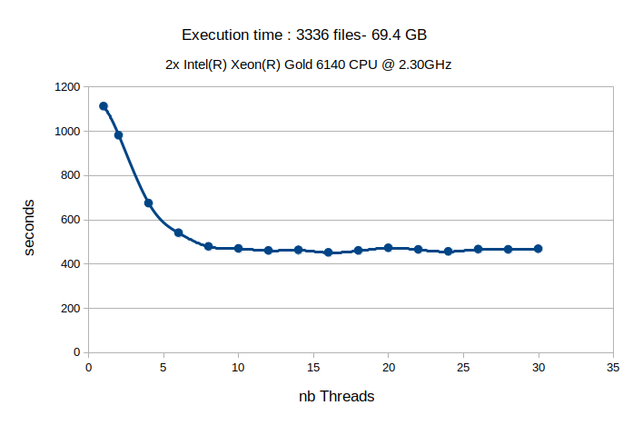
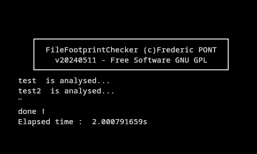

<p align="center">

</p>

#  File Footprint Lister
File Footprint Lister is a software to compute recursively files footprints (md5sum, sha256) of all files in a list of directories.

Lists can be compared using [CompareFootprintLists](https://github.com/FredPont/CompareFootprintLists)

# Quick start
- edit the config/path.csv file
- enter one directory path to scan, per line (no header in this table)

If the path contains spaces, commas... it can be necessary to quote the path : "my,path with, spaces" 
- start the software in the FileFootprintLister directory
```
Usage :

  -a string

        algorithm to use. md5 or sha256 (default "md5")

  -n int

    	number of CPUs for parallel file processing (default 8).
      The optimal number of CPU depends on the CPU and disk speed. 
      Top speed is generally obtained with 8-16 CPUs.

example :

./ffpl-x86_64_linux.bin             # md5 sum computation with 8 files processed in parallel by default

./ffpl-x86_64_linux.bin -n 14       # md5 sum computation with 14 files processed in parallel

./ffpl-x86_64_linux.bin -a md5      # md5 sum computation

./ffpl-x86_64_linux.bin -a sha256   # sha256 sum computation
```
- the result tables in TSV are in the result directory. The output table has 3 columns : 
  - footprint
  - file name
  - file path

# Key characteristics
- unlimited number of directory path
- parallel file processing
- md5 sum calculation
- sha256 sum calculation
- TSV output with 3 columns signatures, name and path
- statically compiled (written in Go), nothing to install 

# Benchmarks


Speed : 7.4 files/sec - 9.2 GB/min

# ScreenShots


