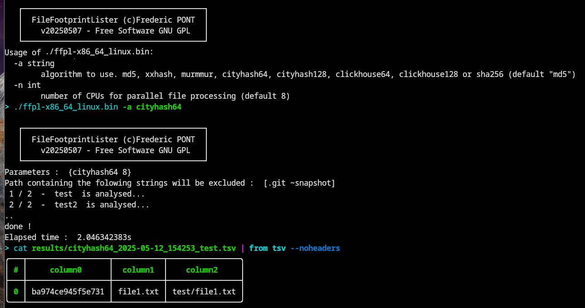

<p align="center">

</p>

#  File Footprint Lister
File Footprint Lister is a software to compute recursively files footprints (md5sum, sha256) of all files in a list of directories

# Quick start
- edit the config/path.csv file
- enter one directory path to scan, per line (no header in this table)
- start the software in the FileFootprintLister directory
```
Usage :

  -a string

        algorithm to use. md5 or sha256 (default "md5")

example :

./ffpl-x86_64_linux.bin             # md5 sum computation 

./ffpl-x86_64_linux.bin -a md5      # md5 sum computation

./ffpl-x86_64_linux.bin -a sha256   # sha256 sum computation
```

# Key characteristics
- unlimited number of directory path
- md5 sum calculation
- sha256 sum calculation
- TSV output with 3 columns signatures, name and path
- statically compiled (written in Go), nothing to install 

# ScreenShots


## Results (md5 - file name - path):
```
826e8142e6baabe8af779f5f490cf5f5        file1.txt       test/file1.txt
1c1c96fd2cf8330db0bfa936ce82f3b9        file2.txt       test2/file2.txt
```